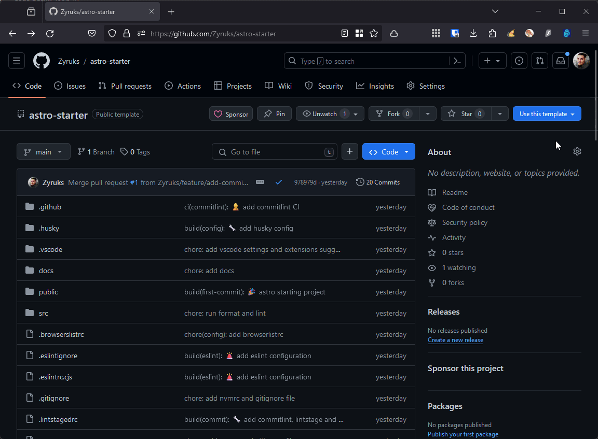

# Astro Starter 🚀

Welcome to `astro-starter`! This template is designed to kick-start your Astro project with a great configuration setup including ESLint, Prettier, Husky, CommitLint, lint-staged, and more. It follows best practices for development, ensuring your project is set up for consistency and maintainability from the start.

<div style="display: flex; gap: 1rem;">

[](https://github.com/Zyruks/astro-starter/actions/workflows/ci.yml)

[](https://github.com/Zyruks/astro-starter/actions/workflows/commitlint.yml)

</div>

- [Welcome to Astro Starter 🚀](#astro-starter-🚀)
- [Getting Started 🏁](#getting-started-🏁)
  - [Create Your Repository from a Template 🌠](#🌠-create-your-repository-from-a-template)
  - [Download Your Newly Created Repository](#download-your-newly-created-repository)
  - [Alternative: Clone the Repository 🚀](#🚀-alternative-clone-the-repository)
  - [Install Dependencies](#install-dependencies)
  - [Start Developing](#start-developing)
- [Features 🌟](#features-🌟)
- [Prerequisites 📋](#prerequisites-📋)
- [Tech Stack 🛠️](#tech-stack-🛠️)
- [Commands 🧞](#🧞-commands)
- [Code Quality Tools 🛠️](#code-quality-tools-🛠️)
- [Contributing 🤝](#contributing-🤝)
- [License 📄](#license-📄)

## Getting Started 🏁

## Features 🌟

- Pre-defined folder structure with examples to get you started quickly.
- Pre-configured ESLint and Prettier for code quality and formatting.
- Husky and CommitLint to enforce commit message guidelines.
- GitHub Actions for Continuous Integration, including format checks, linting, and more.
- Comprehensive documentation for contributing and code of conduct.

## Prerequisites 📋

- Node.js `v18.18.0`
- PNPM `8.11.0`

## Tech Stack 🛠️

`astro-starter` is built with a carefully selected stack of technologies designed to provide an efficient, scalable, and developer-friendly experience. Here's what makes up our tech stack:

- **Framework**: [Astro](https://astro.build/) - A modern framework for building faster websites with less client-side JavaScript.
- **TypeScript**: For adding types to JavaScript, enhancing development experience with type safety and IntelliSense.
- **ESLint**, **Prettier**, **Husky**, **lint-staged**, **CommitLint**: These tools are integrated to ensure code quality, consistency, and enforce commit message guidelines.
- **GitHub Actions**: Automates our CI/CD pipeline, running tests, and checks on every commit.
- **PNPM**: Used for efficient and fast package management.

This stack is configured to offer a seamless development experience, focusing on performance and best practices.

## Getting Started 🏁

Jumpstart your development with `astro-starter` by setting up your project environment. Here's how to get everything ready:

### 🌠 Create Your Repository from a Template

To make things super easy, we've set up `astro-starter` as a template repository. This means you can generate a new repository with the same directory structure and files. Follow these steps:

1. Go to the top right corner of the `astro-starter` GitHub page and click on "Use this template".
2. When the menu opens, click "Create new repository from template".
3. Fill in the repository name and description as you would for any other repo.

<details>
<summary>Visual Representation</summary>



</details>

### Download Your Newly Created Repository

After creating your repository from the `astro-starter` template, download or clone it to your local machine:

```bash
git clone https://github.com/<your-username>/<your-repository-name>.git
cd <your-repository-name>
```

Replace <your-username> and <your-repository-name> with your GitHub username and the name of your newly created repository, respectively.

<details>
<summary>🚀 Alternative: Clone the Repository</summary>

If you prefer to clone the repository directly, you can do so by running the following commands in your terminal:

```bash
git clone https://github.com/zyruks/astro-starter.git
cd astro-starter
```

</details>

### Install Dependencies

Ensure you have PNPM installed, then execute the following command within your project directory to install all necessary dependencies:

```bash
pnpm install
```

### Start Developing

Now that the dependencies are installed, initiate the development server to bring your project to life:

```bash
pnpm run dev
```

You're all set! Dive into the code and start building something amazing with `astro-starter`. Happy coding!

## 🧞 Commands

All commands are run from the root of the project, from a terminal:

| Command                    | Action                                           |
| :------------------------- | :----------------------------------------------- |
| `pnpm install`             | Installs dependencies                            |
| `pnpm run dev`             | Starts local dev server at `localhost:4321`      |
| `pnpm run build`           | Build your production site to `./dist/`          |
| `pnpm run preview`         | Preview your build locally, before deploying     |
| `pnpm run astro ...`       | Run CLI commands like `astro add`, `astro check` |
| `pnpm run astro -- --help` | Get help using the Astro CLI                     |
| `pnpm run lint`            | Lints the codebase for errors                    |
| `pnpm run format`          | Formats the codebase using Prettier              |
| `pnpm run astro ...`       | Run CLI commands like astro add, astro check     |
| `pnpm run astro --`        | --help Get help using the Astro CLI              |

## Code Quality Tools 🛠️

Interested in the code quality tools we use to maintain our project? Check out the documentation for each tool to learn more about how they contribute to our development process:

- [ESLint](docs/code-quality-tools/eslint.md): Ensures code quality and consistency by extending several recommended ESLint plugins, catering specifically to Astro projects as well as TypeScript and JSX accessibility guidelines.
- [Prettier](docs/code-quality-tools/prettier.md): Configured to work alongside ESLint to enforce consistent code formatting, including rules for arrow functions, semi-colons, tab width, and more, with specific overrides for Astro files.
- [CommitLint](docs/code-quality-tools/commitlint.md): Ensures that your commit messages meet the conventional commit format, crucial for automated changelog generation and maintaining a clear project history.
- [Lint-staged](docs/code-quality-tools/lintstaged.md): Automates the process of running linters on staged files before committing, ensuring only code that meets quality standards is committed, helping maintain a clean and error-free codebase.
- [browserslistrc](docs/code-quality-tools/browserslistrc.md): Defines the project's target browsers and environments for various frontend tools, ensuring consistent output across different environments.
- [Validate Branch Name](docs/code-quality-tools/validate-branch-name.md): Ensures branch names follow predefined conventions, improving organizational clarity and streamlining workflow processes.

## Contributing 🤝

We welcome contributions to `astro-starter`! Please read our [CONTRIBUTING.md](docs/CONTRIBUTING.md) guidelines to learn how you can contribute to this project. Also, be sure to review our [CODE_OF_CONDUCT.md](docs/CODE_OF_CONDUCT.md) and [SECURITY.md](docs/SECURITY.md) to understand our community and security practices.

## License 📄

This project is licensed under [MIT License](LICENSE.md). Feel free to clone, modify, and use it in your projects.
